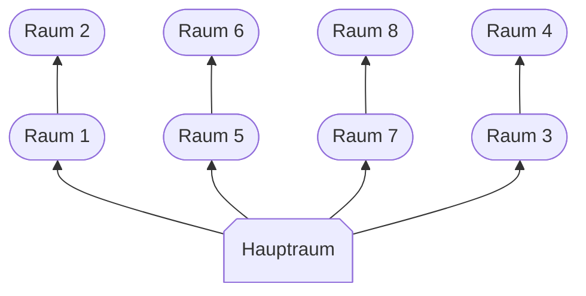

Das Wasserwerk ist ein legendärer Dungeon für Spieler auf Level 60, welcher sich in [[Welten/Wizard City/index|Wizard City]] in der [[Krabbengasse]] befindet. In den Anfangszeiten von Wizard101 stellte es den End-Content-Dungeon des Spiels dar. Er ist als Mehrspieler-Dungeon ausgelegt und für ein volles Team von vier Zauberern empfohlen – vor allem, weil die Kämpfe im Inneren ohne gute Absprache und Teamarbeit sehr fordernd sind.

![[Picture 2025-08-13 14-33-28.jpg]]

Unter der [[Krabbengasse]] verläuft ein System alter Zugangstunnel. Diese Tunnel wurden von einer Bande von Raufbolden aus unbekannten Gründen aufgebrochen, was dazu führte, dass der Wasserdruck rapide schwankte und Probleme sowohl für die [[Krabbengasse]] selbst als auch für die Anwohner der [[Tritonstraße]] an der Oberfläche verursachte. Als Reaktion darauf ruft [[Bruno Rabenaug]]die Legendären Zauberer um Hilfe. Diese werden schließlich von [[Herrmann]] zu einem beschädigten Zugangsturm geführt, wodurch sie den Eindringlingen ins Innere folgen können.

![[Picture 2025-08-13 14-34-31.jpg]]

Im Wasserwerk kann man die ebenso legendäre Wasserwerkausrüstung für alle Schulen erbeuten. Die beiden Hauptgegner im Dungeon, [[Luska Talismund]] und (genannt "Tinti") und [[Sylster Glitzerstrom]], stellen mit ihren speziellen Regeln ("Cheats") noch heute eine Herausforderung für Spieler dieses Levels dar.

---
## Dungeonverlauf

Das Wasserwerk ist nicht linear aufgebaut. Vom Hauptraum aus verzweigen sich mehrere Wege, die zu unterschiedlichen Räumen führen. In einigen warten normale Straßenkämpfe, in anderen Räumen Rätsel und Bossgegner. Die Räume müssen in einer bestimmten Reihenfolge abgeschlossen werden, damit der nächste Bereich zugänglich wird. Die Grafik zeigt den genauen Aufbau des Dungeons und verdeutlicht, wie die einzelnen Räume miteinander verbunden sind.

Wenn du den Dungeon startest landest du im Hauptraum. Hier findest du den großen Strudel in der Mitte und die Steuerkonsole. Hier sprichst du mit [[Glurrup]] und erhältst die erste Dungeon-Quest [[Am Rad Drehen]].

> [!quote]- Dialog mit Glurrup
> 
> „Dies ist kein Ort für einen Luftatmer wie dich!“
> 
> „Schau dich um! Da ist ein großer Strudel in der Mitte des Raumes. Er wird dich in null Komma nichts einsaugen!“
>
> „Und selbst wenn du dem Sog widerstehen kannst, gibt es hier unten fürchterliche Monster. Die halten sich nicht an deine dummen Zauberduell-Regeln!“
>
> „Wenn du bleiben willst: gut! Was auch immer passiert, meine Schuld ist es nicht. Ich bin dann mal weg.“

Gehe in die Mitte des Raumes Richtung Strudel.

> [!info]- Hinweis vom Dungeon
>
> Ein merkwürdiger Wirbel befindet sich an dieser Stelle. Vielleicht lässt er sich mithilfe des Ventils abschalten.

Benutze die Steuerkonsole (Ventil) neben dem Strudel.

> [!info]- Hinweis vom Dungeon
> 
> Leider bewegt sich das Rad keinen Zentimeter. Die Sicherheitshebel müssen betätigt worden sein!
> 
> Es gibt insgesamt vier Sicherheitshebel, die mit dem Ventil verbunden sind. Wenn du das Diagramm hier richtig liest, befindet sich in verschiedenen Räumen hier in der Nähe jeweils ein Hebel.
> 
> Wenn du das Rad drehen und damit das Ventil schließen willst, musst du wohl alle vier Hebel umlegen. Ein Raum ist offen ...
> 
> Leider bewegt sich das Rad keinen Zentimeter. Die Sicherheitshebel müssen betätigt worden sein!
> 
> Es gibt insgesamt vier Sicherheitshebel, die mit dem Ventil verbunden sind. Wenn du das Diagramm hier richtig liest, befindet sich in verschiedenen Räumen hier in der Nähe jeweils ein Hebel.
> 
> Wenn du das Rad drehen und damit das Ventil schließen willst, musst du wohl alle vier Hebel umlegen. Ein Raum ist offen ...

Nachdem die Steuerkonsole benutzt wurde ist die Quest beendet und die Quest [[Hebelwirkung]] beginnt. Vom Hauptraum geht es jetzt in Raum 1, dort erwartet dich ein Kampf gegen vier Gegner, zwei Gegnertypen von der Art [[Schlinger-Aal]] und zwei [[Finnzahn-Hexer]]. 

> [!quote]- Dialog mit Finnzahn-Hexer
> 
> „Wer ist da? Ich dachte der Plan sei, Wizard Citys magischen Krams und Krempel aus der Stadt zu saugen. Von ZAUBERERN hat keiner was gesagt! Wir müssen diesen hier in die Finger kriegen, bevor er abhauen kann!“

Im nächsten Raum – Raum 2 – sind weitere vier Gegner zwei [[Aquamat-Drohne|Aquamat-Drohnen]] und zwei [[Flussklamm-Wache|Flussklamm-Wachen]]. 

Nach dem Sieg muss der Hebel betätigt werden, um den nächsten Bereich freizuschalten. Hiermit endet die Quest [[Hebelwirkung]].

> [!quote]- Hinweis vom Dungeon
> 
> Du legst den ersten Sicherheitshebel um. Ein guter Anfang!

Im Anschluss beginnt die Quest [[Tintenfrisch]]. Zurück im Hauptraum angekommen, schwimmt man in Raum 3 und landet in einem Raum voller gigantischen Muscheln. Direkt am Eingang steht ein Hinweisbuch „In der Muschelklemme“. 

> [!info]- Inhalt von „In der Muschelklemme“
> 
> Bevor die Lichter verglühen, öffne alle blauebn Muscheln, um eine Belohnung zu erhalten. Gelbe Muscheln dagegen bringen Unglück.

Bei Erfolg erhaltet ihr Zugang zum nächsten Raum und es spawnen Lebenskugeln. Scheitert ihr, müsst ihr gegen vier [[Schimmernder Geist|Schimmernde Geister]] kämpfen. In Raum 4 wartet [[Luska Talismund]] auf euch. Die Regeln und Cheats von [[Luska Talismund]] findest du im Eintrag von ihm.

> [!quote]- Dialog mit Luska Talismund 
> 
> „Denke ja nicht, du könntest unsere Goldader lahmlagen und damit davonkommen. Du gehst hier nicht lebend raus!“

Nach dem Kampf kann man den zweiten Sicherheitshebel umlegen.

> [!info]- Hinweis vom Dungeon
> 
> Du legst den zweiten Sicherheitshebel um. Die Hälfte ist geschafft!

Direkt im Anschluss an [[Tintenfrisch]] beginnt die Quest [[Fang des Tages]].

Vom Hauptraum aus geht es nun in Raum 5. Dort wartet ein Kampf gegen vier Gegner: zwei [[Schwingenfinn-Schlitzer]] und zwei [[Finnzahn-Marodierer]].

> [!quote]- Dialog mit Finnzahn-Marodierer
> 
> „Nanu, was hat das denn zu bedeuten? Schwimmst und mit voller Absicht ins Netz?“
> 
> „Spielt keine Rolle ... du bist der Fang des Tages!“

Im nächsten Raum – Raum 6 – warten weitere vier Gegner: zwei [[Flussklamm-Schamane|Flussklamm-Schamanen]] und zwei [[Tidesturm-Elementar|Tidesturm-Elementare]].

Nach dem Sieg muss der dritte Sicherheitshebel umgelegt.

>[!info]- Hinweis vom Dungeon
>
> Du legst den dritten Sicherheitshebel um. Einer noch!

Damit ist die Quest [[Fang des Tages]] abgeschlossen und die Quest [[Stromausfall]] beginnt. Im Raum 8 befindet sich ein Rätselraum. In der Mitte des Raumes steht ein Bücherpult.

> [!info]- Inhalt des Buches
> 
> Beginne hier, um „Folge der Flosse“ zu spielen.

Wird das Buch benutzt, erscheint ein Aal, der die Hebel in einer bestimmten Reihenfolge abschwimmt. In genau dieser Reihenfolge müssen die Hebel betätigt werden.

Bei Erfolg erscheinen Lebenskugeln, und der Zugang zum nächsten Raum öffnet sich. Ziehst du jedoch einen falschen Hebel, erscheinen vier [[Schlinger-Aal|Schlinger-Aale]].

>[!quote]- Dialog mit Celestisches Konstrukt
>
> „Diese Zauberer werden alles ruinieren, falls wir ihnen gestatten zu fliehen. Schnappt sie!“

Es folgt ein Kampf gegen vier Gegner: zwei [[Celestisches Konstrukt|Celestisches Konstrukte]] und zwei [[Flussklaue|Flussklauen]].

Nach dem Kampf muss der vierte Sicherheitshebel umgelegt werde.

>[!info]- Hinweis vom Dungeon
>
> Du legst den vierten Sicherheitshebel um. Schließe jetzt das Ventil im Hauptraum!

Zurück im Hauptraum wird die Steuerkonsole (Ventil) benutzt.

> [!info]- Hinweis vom Dungeon
>
> Kaum schließt du das Ventil, verschwindet der Strudel. Fertig!

Anschließend taucht [[Sylster Glitzerstrom]] auf. 

>[!quote]- Dialog mit Sylster Glitzerstrom
>
> „Soso, DU bist also der Störenfried, der hier alle durcheinander brachte und meinen schönen Mahlstrom zerstört hat, der magischen Krimskrams von überallher ansaugte!“
>
> „Jetzt habe ich rein gar nichts! Dafür wirst du bezahlen!“

Es folgt der finale Kampf gegen [[Sylster Glitzerstrom]] mit Unterstützung durch [[Hammerbann-Hexer]] und [[Wasserschwinge]]. Die Regeln zum Kampf findest du im Eintrag von ihm. Nach seiner Niederlage:

>[!quote]- Dialog mit Sylster Glitzerstrom
>
> „Na warte, man sieht sich immer zweimal!“

Am Ende des Dungeons erscheint die Wasserwerk-Truhe. Das Öffnen kostet beim ersten Öffnen 50 Kronen und ermöglicht einen zusätzlichen Beutezug aus der Belohnungsliste des Dungeons.