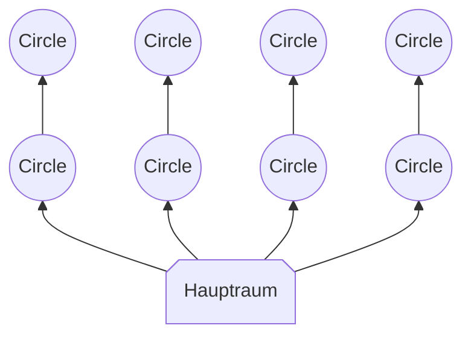

---
## Testing

```mermaid
flowchart BT
    n2["Hauptraum"] --> n3(("Circle")) & n4(("Circle")) & n8(("Circle")) & n9(("Circle"))
    n4 --> n5(("Circle"))
    n3 --> n7(("Circle"))
    n8 --> n10(("Circle"))
    n9 --> n11(("Circle"))
    n2@{ shape: loop-limit}
```
